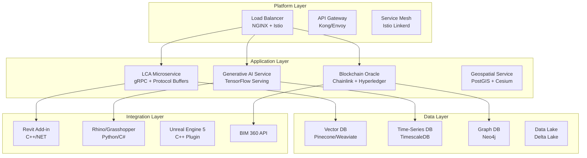

Bend the emissions curve of the built environment
==========

Architecture
------------

Quick Start
-----------
1) Set environment variables (optional):
   - `export ECOINVENT_API_KEY=...`
   - `export REVIT_API_KEY=...`
2) Start the stack:
   - `docker compose up --build`
3) Open the API:
   - `http://localhost:8000`

Health and Tasks
----------------
- Healthcheck: `GET /health`
- Celery ping: `POST /tasks/ping`
- Task status: `GET /tasks/status/{task_id}`
